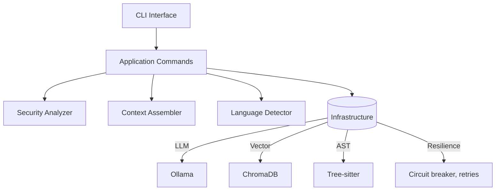

# FalconEYE

AI-powered security code review for modern engineering teams. FalconEYE v2.0 combines semantic code understanding, retrieval-augmented context, and resilient infrastructure to surface real vulnerabilities with fewer false positives — all running locally.

## Why FalconEYE

- **Semantic reasoning over pattern matching**: Goes beyond signatures to understand intent, data flow, and business logic.
- **Context-aware via RAG**: Enriches analysis with semantically similar code from your entire codebase.
- **Lower noise**: Optional AI validation step reduces false positives.
- **Fast and incremental**: Smart re-indexing only processes changed files.
- **Privacy-first**: Runs locally against your own Ollama deployment; your code never leaves your machine.

## How it works

```
┌─────────────────────────────────────────────────────────────────┐
│ 1) CODE INGESTION       Scan repo → detect languages → parse AST │
└───────────────┬─────────────────────────────────────────────────┘
                │
┌───────────────▼─────────────────────────────────────────────────┐
│ 2) INTELLIGENT INDEX  Chunk semantically → embed → store (Chroma)│
└───────────────┬─────────────────────────────────────────────────┘
                │
┌───────────────▼─────────────────────────────────────────────────┐
│ 3) CONTEXT ASSEMBLY   Retrieve similar code (RAG) across project │
└───────────────┬─────────────────────────────────────────────────┘
                │
┌───────────────▼─────────────────────────────────────────────────┐
│ 4) AI ANALYSIS       LLM reasoning → data-flow → vuln detection  │
└───────────────┬─────────────────────────────────────────────────┘
                │
┌───────────────▼─────────────────────────────────────────────────┐
│ 5) VALIDATION/OUTPUT Optional validation → console/JSON/SARIF    │
└─────────────────────────────────────────────────────────────────┘
```

## Quickstart

### Prerequisites

- Python >= 3.12
- Ollama running locally (https://ollama.ai)

### Install

```bash
# Pull the recommended models
ollama pull qwen3-coder:30b
ollama pull embeddinggemma:300m

# Install FalconEYE from source (editable)
pip install -e .
```

FalconEYE will use the default configuration on first run. You can customize settings by creating `~/.falconeye/config.yaml` (see [Configuration](#configuration) section).

### Your First Scan

# Optionally include extras (ollama client, tests, linters)
pip install -e .[ollama]
pip install -e .[test]
pip install -e .[lint]

# Initialize configuration
falconeye config --init
```

### First scan

```bash
# 1) Index your repository (one-time per project, incremental afterwards)
falconeye index /path/to/your/project

# 2) Review for vulnerabilities
falconeye review /path/to/your/project

# (Optional) Do both in one step
falconeye scan /path/to/your/project
```

## Usage

### Common examples

```bash
# Review a single file
falconeye review src/auth/login.py

# Review a directory with console output
falconeye review src/ --output console

# Save machine-readable JSON
falconeye review src/ --output json --output-file findings.json

# Generate SARIF for CI platforms
falconeye review src/ --output sarif --output-file results.sarif

# Tighten reporting to high+ severity and enable validation
falconeye review src/ --severity high --validate
```

### Indexing controls

```bash
# Human-readable console output
falconeye review src/ --format console

# Machine-readable JSON (auto-generates HTML report too)
falconeye review src/ --format json --output findings.json

# HTML report with interactive dashboard
falconeye review src/ --format html --output report.html

# SARIF for CI/CD integration
falconeye review src/ --format sarif --output results.sarif
```

**Default Behavior**: When no output file is specified, FalconEYE automatically saves both JSON and HTML reports to `./falconeye_reports/` with timestamps:
```bash
falconeye scan /path/to/project
# Generates:
# - falconeye_project_20251112_171500.json
# - falconeye_project_20251112_171500.html
```

### Project Management
# Exclude paths/patterns and force a full re-index
falconeye index . \
  --exclude "*/node_modules/*" \
  --exclude "*.min.js" \
  --force-reindex

# Override language auto-detection and chunking
falconeye index . --language python --chunk-size 80 --chunk-overlap 12
```

### Project management

```bash
# List all indexed projects
falconeye projects list

# Show project details
falconeye projects info <project-id>

# Delete an indexed project (non-recoverable)
falconeye projects delete <project-id> -y

# Clean up metadata for files removed from disk
falconeye projects cleanup <project-id> -y
```

### System info and configuration

```bash
# Display version, model connectivity, and config summary
falconeye info

# Create default config, show active config, or specify a path
falconeye config --init
falconeye config --show
falconeye config --path ./falconeye.yaml --show
```

## CLI reference

| Command | Purpose |
| --- | --- |
| `falconeye index <path>` | Index codebase (embeddings + metadata). Options: `-l/--language`, `--chunk-size`, `--chunk-overlap`, `-e/--exclude`, `--project-id`, `--force-reindex`, `-c/--config`, `-v/--verbose` |
| `falconeye review <path>` | Review file/dir. Options: `-l/--language`, `--validate`, `--top-k`, `-o/--output [console|json|sarif]`, `--output-file`, `--severity`, `-c/--config`, `-v/--verbose` |
| `falconeye scan <path>` | Index + review. Options: `-l/--language`, `--validate`, `-o/--output`, `--output-file`, `--project-id`, `--force-reindex`, `-c/--config`, `-v/--verbose` |
| `falconeye info` | Show system information. |
| `falconeye config` | Manage configuration. Options: `--init`, `--path`, `--show` |
| `falconeye projects list` | List indexed projects. |
| `falconeye projects info <id>` | Show project details. |
| `falconeye projects delete <id>` | Delete a project. Options: `-y/--yes`, `-c/--config` |
| `falconeye projects cleanup <id>` | Remove metadata for deleted files. Options: `-y/--yes`, `-c/--config` |

Run `falconeye --help` for complete documentation.

## Configuration

FalconEYE uses a hierarchical configuration system. Configuration files are loaded in this order (later files override earlier ones):

1. Default config: `<install-dir>/config.yaml`
2. User config: `~/.falconeye/config.yaml`
3. Project config: `./falconeye.yaml`

Create `~/.falconeye/config.yaml` to customize settings:
FalconEYE looks for configuration in:

1. Project file `./falconeye.yaml` (optional)
2. User file `~/.falconeye/config.yaml`

Example (aligns with defaults in `config.yaml`):

```yaml
llm:
  provider: ollama
  model:
    analysis: qwen3-coder:30b
    embedding: embeddinggemma:300m
  base_url: http://localhost:11434
  timeout: 600                      # Request timeout in seconds

analysis:
  top_k_context: 5          # Number of similar code chunks to retrieve
  validate_findings: true    # Enable AI validation pass
  batch_size: 10            # Files to process in parallel

logging:
  level: INFO               # DEBUG, INFO, WARNING, ERROR, CRITICAL
  file: ./falconeye.log     # Log file path
  console: true             # Enable console logging
  rotation: daily           # Log rotation strategy
  retention_days: 30        # Days to retain logs
```

See the [default config.yaml](config.yaml) for all available options.

## Supported Languages
  timeout: 120
  retry:
    max_retries: 3
    initial_delay: 1.0
    max_delay: 30.0
    exponential_base: 2.0
    jitter: 0.1
  circuit_breaker:
    failure_threshold: 5
    success_threshold: 2
    timeout: 60.0

vector_store:
  provider: chroma
  persist_directory: ./falconeye_data/vectorstore
  collection_prefix: falconeye

metadata:
  provider: chroma
  persist_directory: ./falconeye_data/metadata
  collection_name: metadata

chunking:
  default_size: 50
  default_overlap: 10
  max_chunk_size: 200

analysis:
  top_k_context: 5
  validate_findings: true
  batch_size: 10

languages:
  enabled: [python, javascript, typescript, go, rust, c, cpp, java, dart, php]

file_discovery:
  default_exclusions:
    - "*/node_modules/*"
    - "*/venv/*"
    - "*/virtualenv/*"
    - "*/.git/*"
    - "*/dist/*"
    - "*/build/*"
    - "*/__pycache__/*"
    - "*/target/*"
    - "*.min.js"
    - "*.pyc"

output:
  default_format: json
  color: true
  verbose: false
  save_to_file: false
  output_directory: ./falconeye_reports

logging:
  level: INFO
  file: ./falconeye.log
  console: true
  rotation: daily
  retention_days: 30
```

## Architecture

FalconEYE follows a hexagonal architecture with clear separation of concerns.



Key properties:

- **Domain**: core review and validation logic.
- **Application**: use-case orchestration and workflows.
- **Infrastructure**: LLM, storage, parsing, logging, resilience.
- **Adapters**: CLI and output formatters.

## Storage and data

- Vectors and metadata are stored under `falconeye_data/` by default.
- Reports are written to `falconeye_reports/` when `--output-file` is used or `output.save_to_file` is enabled.

## Supported languages

Current coverage (configurable):

Python • JavaScript • TypeScript • Go • Rust • C • C++ • Java • Dart • PHP

Extend support via language-specific plugins and prompts.

## Performance and smart re-indexing

FalconEYE tracks file changes after the initial index and only reprocesses modified files, dramatically reducing subsequent scan times while maintaining context integrity. See `docs/SMART_REINDEXING_GUIDE.md` for details.

## Understanding the output

### Console example

FalconEYE supports multiple output formats for different use cases:

### Console Format
Interactive terminal output with color-coded severity levels:
```
╭─ SQL Injection Vulnerability ────────────────────────────────╮
│ Severity: HIGH | CWE-89                                       │
│ File: app/database.py:42                                      │
│                                                               │
│ The function executes raw SQL with user input without        │
│ parameterization, allowing SQL injection attacks.            │
│                                                               │
│ Recommendation:                                               │
│ Use parameterized queries or an ORM to safely handle user    │
│ input in database operations.                                │
╰───────────────────────────────────────────────────────────────╯
```

### JSON Format
Machine-readable format for CI/CD integration and programmatic processing:
### JSON example

```json
{
  "findings": [
    {
      "id": "uuid",
      "issue": "SQL Injection Vulnerability",
      "severity": "high",
      "confidence": {"value": "high", "level": "high"},
      "location": {
        "file_path": "app/database.py",
        "line_start": 42,
        "line_end": 45
      },
      "code_snippet": "...",
      "reasoning": "...",
      "mitigation": "Use parameterized queries...",
      "cwe_id": "CWE-89"
    }
  ]
}
```

### HTML Format
**Rich, interactive reports with executive summary** (auto-generated with JSON):

- **Executive Dashboard**: Total findings, severity breakdown, scan statistics
- **Interactive Filtering**: Filter findings by severity level
- **Detailed Findings**: 
  - Color-coded severity badges
  - File locations with line numbers
  - Code snippets with ±4 lines of context
  - Highlighted vulnerable lines
  - Mitigation recommendations
  - CWE IDs and tags
- **Professional Design**: Modern, responsive, print-friendly layout

HTML reports are automatically generated alongside JSON reports when using default settings.

### SARIF Format
Industry-standard format compatible with GitHub Security, GitLab, and other DevSecOps platforms.

## CLI Command Reference

| Command | Description |
|---------|-------------|
| `falconeye index <path>` | Index codebase for analysis |
| `falconeye review <path>` | Analyze code for vulnerabilities |
| `falconeye scan <path>` | Index and review in one step |
| `falconeye projects list` | Show all indexed projects |
| `falconeye projects info <id>` | Display project details |
| `falconeye projects delete <id>` | Delete a project and its data |
| `falconeye projects cleanup` | Remove orphaned project data |
| `falconeye info` | System and configuration information |
### SARIF

Industry-standard output for CI/CD platforms including GitHub and GitLab.

## Troubleshooting

- **Ollama connection**: Ensure `ollama serve` is running on `http://localhost:11434` and required models are pulled.
- **No results**: Verify you ran `falconeye index` before `review` (or use `scan`).
- **Performance**: Use exclusions and language hints to narrow scope.
- **Diagnostics**: Run `falconeye info` to verify environment and config.

## Development

```bash
# Developer install (includes test, lint, ollama extras)
pip install -e .[dev]

# Tests
pytest
pytest tests/integration/ -v  # requires Ollama

# Linting & formatting
ruff check .
black .
mypy src/
```

## Documentation

- `docs/ARCHITECTURE_SUMMARY.md`
- `docs/SMART_REINDEXING_GUIDE.md`
- `docs/IMPLEMENTATION_STATUS.md`
- `docs/MIGRATION_GUIDE.md`

## Security and privacy

FalconEYE analyzes code locally using your Ollama instance. No code or metadata is transmitted to external services unless you explicitly configure otherwise.

## License

MIT License

Copyright (c) 2025 hardw00t h4ckologic

Permission is hereby granted, free of charge, to any person obtaining a copy
of this software and associated documentation files (the "Software"), to deal
in the Software without restriction, including without limitation the rights
to use, copy, modify, merge, publish, distribute, sublicense, and/or sell
copies of the Software, and to permit persons to whom the Software is
furnished to do so, subject to the following conditions:

The above copyright notice and this permission notice shall be included in all
copies or substantial portions of the Software.

THE SOFTWARE IS PROVIDED "AS IS", WITHOUT WARRANTY OF ANY KIND, EXPRESS OR
IMPLIED, INCLUDING BUT NOT LIMITED TO THE WARRANTIES OF MERCHANTABILITY,
FITNESS FOR A PARTICULAR PURPOSE AND NONINFRINGEMENT. IN NO EVENT SHALL THE
AUTHORS OR COPYRIGHT HOLDERS BE LIABLE FOR ANY CLAIM, DAMAGES OR OTHER
LIABILITY, WHETHER IN AN ACTION OF CONTRACT, TORT OR OTHERWISE, ARISING FROM,
OUT OF OR IN CONNECTION WITH THE SOFTWARE OR THE USE OR OTHER DEALINGS IN THE
SOFTWARE.

---
